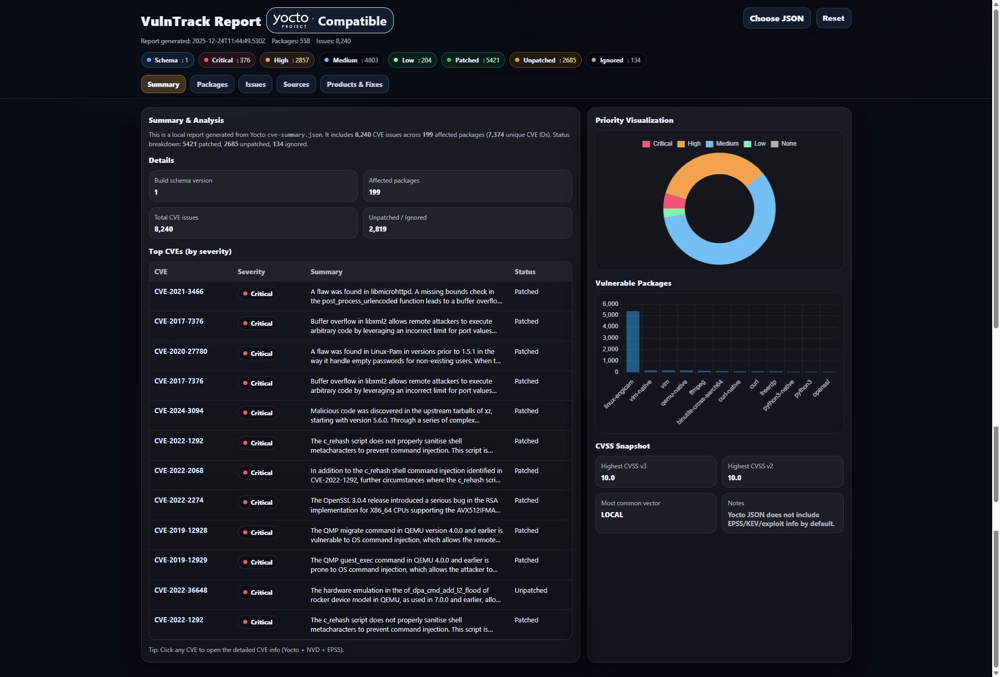
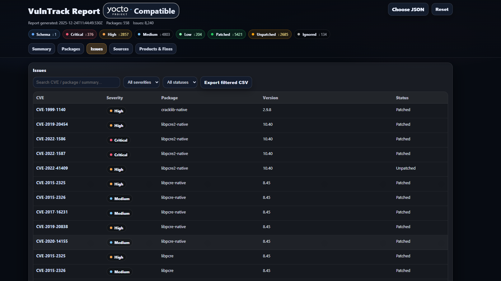
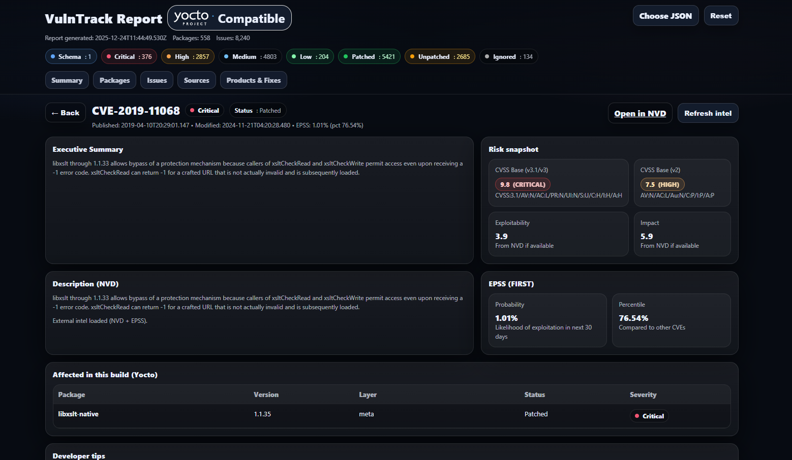

<p align="center">
  
</p>

<p align="center">
<a
  
  
  
  
  
</a>
</p>

# VulnTrack — Yocto CVE Dashboard

VulnTrack is a lightweight, browser-based dashboard for visualizing Yocto
`cve-summary.json` reports.  
It runs entirely on the client side using HTML, CSS, and JavaScript — no backend,
no server, no data upload.

Inspired by GTI-style vulnerability intelligence dashboards and designed
specifically for Yocto-based systems.

---

## Demo

### Summary Dashboard


### Issues View


### GTI-style CVE View


---

## How to Run Locally

### Option 1: Open Directly
Open index.html directly in your browser.

### Option 2: Run a Local Server (Recommended)

```bash
python3 -m http.server 8080
```

Then open http://localhost:8080

---

## How to Use

1. Generate Yocto CVE data (cve-summary.json)
2. Open the VulnTrack dashboard
3. Click Choose JSON
4. Select your cve-summary.json file
5. Explore Summary, Packages, Issues, and other tabs
6. Click CVEs for details
7. Export CSV if needed

---

## Notes & Limitations

Yocto CVE JSON does not include EPSS, KEV, exploit intelligence, or ATT&CK mappings.
These can be added later via enrichment or external APIs.

---

## Intended Audience

Embedded Linux developers, Yocto maintainers, security engineers, and cybersecurity analysts.

---

## License

Internal / personal usage. Update if open-sourcing.
