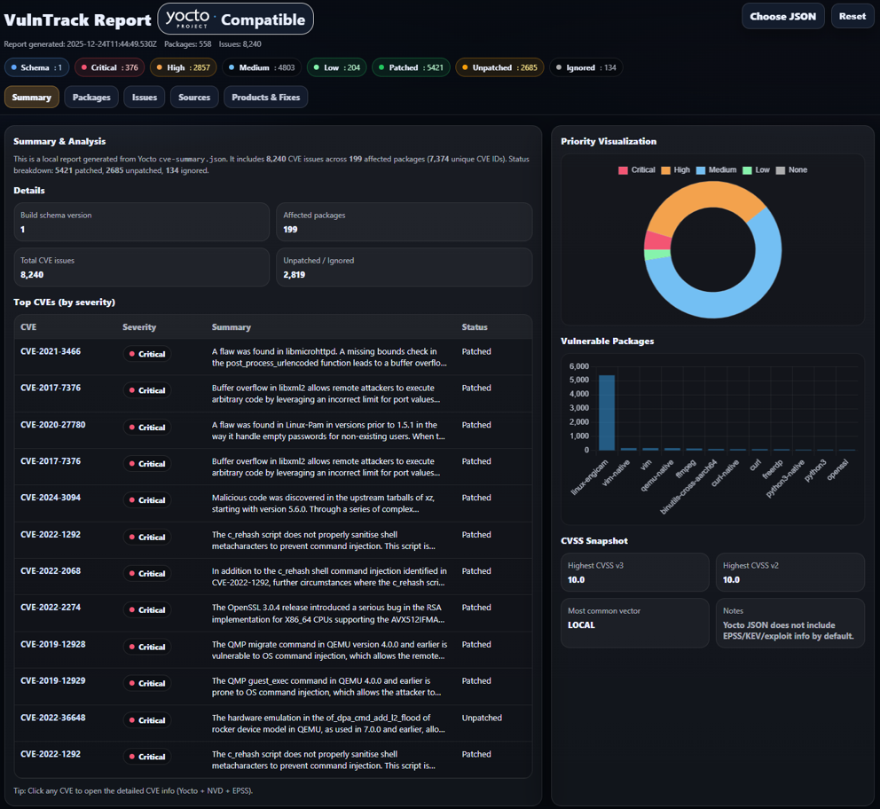
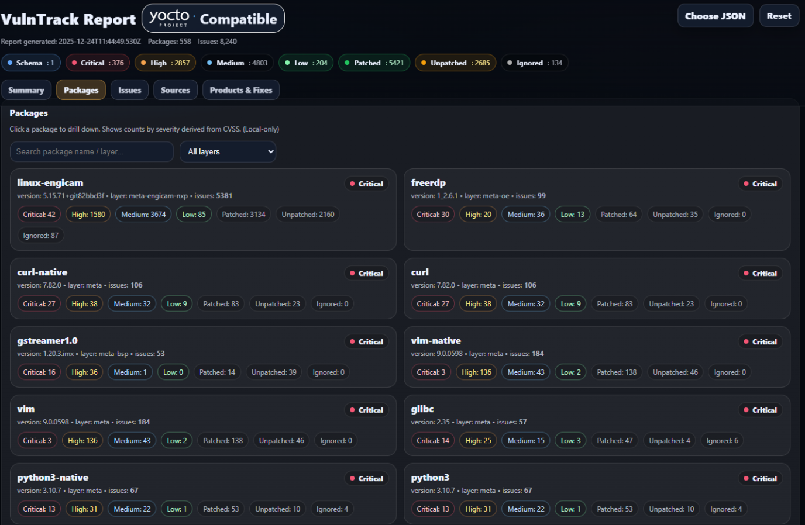
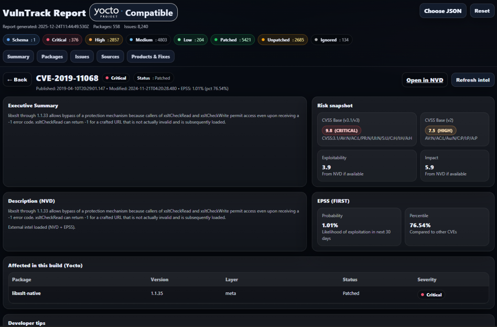

<p align="center">
  
</p>

<p align="center">
<a
  
  
  
  
  
</a>
</p>


# VulnTrack — Yocto CVE Dashboard & Vulnerability Report Exporter

VulnTrack is a lightweight, browser-based Yocto CVE dashboard for analyzing `cve-summary.json` reports generated by Yocto Project builds.

It helps embedded Linux, product security, and compliance teams review CVEs, affected packages, severity distribution, patch status, SBOM context, and export professional vulnerability reports in HTML, PDF, Markdown, JSON, and CSV formats.

VulnTrack runs entirely in the browser. No backend, no server, no database, and no vulnerability data upload.

---

## Why VulnTrack?

Yocto builds can generate useful vulnerability data, but the raw `cve-summary.json` output is not always easy to review, share, or use for release decisions.

VulnTrack turns Yocto CVE output into a readable local dashboard and exportable security report so teams can quickly understand:

* Which packages are affected by CVEs
* Which vulnerabilities are Critical, High, Medium, Low, or None
* Which findings are Patched, Unpatched, or Ignored
* Which packages contribute most to product risk
* What should be reviewed before release
* What evidence can be exported for security review or release approval

Unlike general-purpose vulnerability management platforms, VulnTrack is focused specifically on Yocto Project CVE output and runs locally in the browser without requiring a backend, database, account, or data upload.

---

## Key Features

* Browser-based Yocto `cve-summary.json` analysis
* Local-only vulnerability review with no backend
* Summary dashboard for packages, CVEs, severity, and patch status
* Package-level vulnerability drill-down
* CVE-focused issue view
* Severity and status distribution charts
* Package risk summary
* Remediation-focused report sections
* HTML, PDF, Markdown, JSON, and CSV export support
* SBOM analysis support
* SPDX 3.0.1 SBOM support
* Security and license profile customization for SBOM review
* Useful for embedded Linux product security and release readiness reviews

---

## Use Cases

VulnTrack is useful for:

* Yocto `cve-summary.json` analysis
* Yocto CVE report visualization
* Embedded Linux vulnerability review
* Product security release checks
* CVE triage for Yocto-based firmware
* SBOM-assisted vulnerability review
* Security review reports for release readiness
* Local vulnerability report generation
* CRA-oriented vulnerability management evidence
* Internal vulnerability review documentation

---

## CRA-Oriented Vulnerability Management

VulnTrack can support CRA-oriented vulnerability management workflows by helping Yocto-based product teams review, prioritize, and document CVE findings as part of release readiness and product security evidence.

VulnTrack is not a complete CRA compliance solution by itself. It is intended to support the technical vulnerability review and reporting part of a broader secure development and product security process.

---

## Live Demo

Open the VulnTrack dashboard here:

https://prashantdivate.github.io/VulnTrack/

---

## Snapshots

### Summary Dashboard


### Packages View


### CVE View

---

## How VulnTrack Works

1. Generate Yocto CVE data from your Yocto build.
2. Open the VulnTrack dashboard in a browser.
3. Upload the generated `cve-summary.json` file.
4. Review the Summary, Packages, Issues, Sources, Products & Fixes, and SBOM views.
5. Inspect CVE details and affected packages.
6. Export reports in HTML, PDF, Markdown, JSON, or CSV format.
7. Use the exported reports for review, release readiness, or internal documentation.

All processing happens locally in the browser.

---

## Yocto CVE Data Generation

Add the following configuration in your Yocto build `build/conf/local.conf` file:

```conf
INHERIT += " cve-check create-spdx "
CVE_SOCKET_TIMEOUT = "180"
include conf/distro/include/cve-extra-exclusions.inc
```

After the build, use the generated Yocto CVE summary JSON file with VulnTrack.

The expected input file is typically:

```text
cve-summary.json
```

---

## SBOM Analysis

VulnTrack also supports SBOM review for Yocto-generated SPDX data.

To analyze an SBOM:

1. Open the VulnTrack dashboard.
2. Click the SBOM tab.
3. Click Choose SBOM.
4. Upload the generated SPDX JSON file.
5. Click individual components to inspect details.

Supported SBOM direction:

* Yocto-generated SPDX JSON
* Modern SPDX 3.0.1-oriented analysis
* Component-level review
* Security and license profile customization

---

## Report Export Support

VulnTrack can export vulnerability review data in multiple formats:

| Format   | Purpose                                                    |
| -------- | ---------------------------------------------------------- |
| HTML     | Shareable browser-based vulnerability report               |
| PDF      | Professional report for review, sign-off, or documentation |
| Markdown | Lightweight text report for GitHub, tickets, or notes      |
| JSON     | Machine-readable summary output                            |
| CSV      | Row-level export for spreadsheets or tracking              |

The exported reports are useful for internal product security review, release readiness checks, and vulnerability management documentation.

---

## Running Locally

### Option 1: Open Directly

Open `index.html` directly in your browser.

### Option 2: Run a Local Server

```bash
python3 -m http.server 8080
```

Then open:

```text
http://localhost:8080
```

---

## Intended Audience

VulnTrack is designed for:

* Embedded Linux developers
* Yocto Project engineers
* Yocto maintainers
* Firmware security teams
* Product security engineers
* Security reviewers
* Compliance support teams
* Cybersecurity analysts working with embedded Linux products

---

## Notes and Limitations

Yocto CVE JSON does not include all external vulnerability intelligence fields by default.

Examples of data that may require external enrichment:

* EPSS
* CISA KEV
* Exploit availability
* ATT&CK mappings
* Vendor-specific impact analysis
* Runtime reachability
* Product-specific exploitability assessment

VulnTrack focuses on making Yocto CVE and SBOM data easier to review, prioritize, and report. Additional intelligence enrichment can be added later through external APIs or offline data sources.

---

## Roadmap Ideas

Potential future improvements:

* EPSS enrichment
* CISA KEV matching
* CVE trend indicators
* Exploit intelligence enrichment
* Runtime exposure tagging
* Better SBOM-to-CVE correlation
* Release comparison reports
* Multiple report comparison
* Saved review notes
* Risk acceptance tracking
* GitHub Actions integration
* Offline vulnerability database support

---

## Project Positioning

VulnTrack is a local-first Yocto vulnerability review tool.

It is best used as part of a product security workflow where teams need to review Yocto CVE findings, understand affected packages, document release risk, and export vulnerability evidence without uploading sensitive build or product data to an external service.

---

## Keywords

Yocto CVE dashboard, Yocto vulnerability report, Yocto cve-summary.json analyzer, embedded Linux vulnerability management, embedded Linux security dashboard, Yocto SBOM analysis, SPDX vulnerability review, CVE report exporter, PDF vulnerability report, HTML vulnerability report, product security evidence, CRA vulnerability management, Cyber Resilience Act, local vulnerability dashboard.

---

## License

This project is licensed under the MIT License. See the [LICENSE](LICENSE) file for details.
